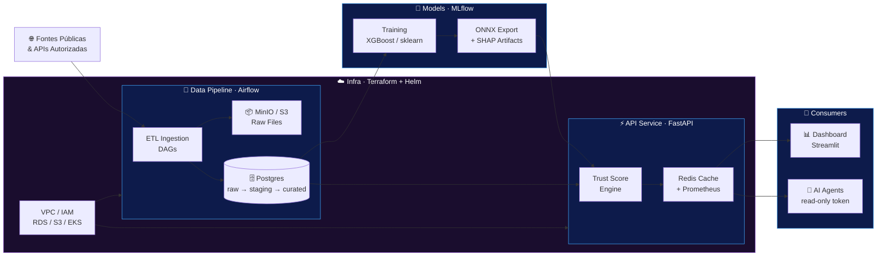
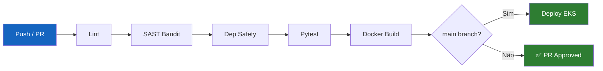

<p align="center">
  
</p>

<p align="center">
  <a href="https://github.com/maykonlincolnusa/Security-Bank-assessment/actions">
    
  </a>
  
  
  
  
</p>

<p align="center">
  
  
  
  
  
</p>

<p align="center">
  
  
  
  
</p>

<p align="center">
  <a href="https://git.io/typing-svg">
    
  </a>
</p>

---

> ⚠️ **Aviso Legal:** Este sistema é **auxílio de decisão**. Não substitui análise humana, parecer jurídico ou decisões regulatórias. Utilize os scores como insumo complementar a processos supervisionados por profissionais qualificados.

---

## 📑 Índice

- [Visão Geral](#-visão-geral)
- [Arquitetura do Sistema](#-arquitetura-do-sistema)
- [Stack Tecnológico](#-stack-tecnológico)
- [Estrutura do Monorepo](#-estrutura-do-monorepo)
- [Quick Start](#-quick-start)
- [Execução por Módulo](#-execução-por-módulo)
- [Pipeline ETL](#-pipeline-etl)
- [Modelos de ML](#-modelos-de-ml)
- [API de Scoring](#-api-de-scoring)
- [Dashboard Analítico](#-dashboard-analítico)
- [Infraestrutura Cloud](#-infraestrutura-cloud)
- [Segurança & Compliance](#-segurança--compliance)
- [Testes & Qualidade](#-testes--qualidade)
- [Contribuição](#-contribuição)
- [Licença](#-licença)

---

## 🏦 Visão Geral

O **Trust Bank System** é uma plataforma open-source de ponta a ponta para geração, servição e explicação de **Trust Scores** de instituições financeiras. Ele integra coleta de dados públicos e APIs autorizadas, pipeline ETL orquestrado por Airflow, treinamento e exportação de modelos de ML (scikit-learn, XGBoost, ONNX), uma API REST de alto desempenho com autenticação JWT/OAuth2, e um dashboard analítico interativo — tudo implantável em cloud (AWS/EKS) via Terraform e Helm.

```
╔══════════════════════════════════════════════════════════════════════════════╗
║                        TRUST BANK SYSTEM · v0.1.0                          ║
║                                                                              ║
║   Fontes Públicas ──► ETL Airflow ──► Postgres / MinIO ──► ML Training      ║
║         └──────────────────────────────────────────────────► ONNX Model     ║
║                                                                  │           ║
║   Agentes AI ◄── API FastAPI (JWT · RBAC · Redis) ◄─────────────┘           ║
║   Dashboard ◄───────────────────┘                                            ║
║                                                                              ║
║   Infraestrutura: Terraform · EKS · Helm · GitHub Actions                   ║
║   Compliance: LGPD · GDPR · STRIDE · Audit Logs · Bandit                    ║
╚══════════════════════════════════════════════════════════════════════════════╝
```

### ✨ Diferenciais

| Característica | Detalhe |
|---|---|
| 🔄 **Pipeline ETL Completo** | Airflow DAGs, camadas raw/staging/curated, MinIO/S3 |
| 🤖 **ML Explicável** | XGBoost + SHAP + ONNX export + MLflow tracking |
| ⚡ **API Production-Grade** | FastAPI async, JWT/OAuth2, RBAC, Redis cache, Prometheus |
| 📊 **Dashboard Analítico** | Streamlit com visualizações de score e explicabilidade |
| 🔒 **Security-First** | STRIDE, LGPD/GDPR, prompt injection tests, audit logs |
| ☁️ **Cloud-Native** | Terraform (VPC/IAM/RDS/S3/EKS) + Helm + CI/CD |

---

## 🏗 Arquitetura do Sistema



---

## 🛠 Stack Tecnológico

```
╔══════════════════════════════════════════════════════════════════════╗
║  CAMADA             TECNOLOGIAS                                      ║
╠══════════════════════════════════════════════════════════════════════╣
║  Data Engineering   Python · Apache Airflow · pandas · SQLAlchemy   ║
║                     PostgreSQL 15 · MinIO / AWS S3                  ║
╠══════════════════════════════════════════════════════════════════════╣
║  Machine Learning   scikit-learn · XGBoost · PyTorch (opcional)     ║
║                     Prophet / LSTM · SHAP · MLflow · ONNX Runtime   ║
╠══════════════════════════════════════════════════════════════════════╣
║  API & Services     FastAPI · Uvicorn · Redis 7 · OAuth2 Bearer     ║
║                     JWT · RBAC · Prometheus Metrics                  ║
╠══════════════════════════════════════════════════════════════════════╣
║  Dashboard          Streamlit · Plotly · pandas                     ║
╠══════════════════════════════════════════════════════════════════════╣
║  Infra & DevOps     Terraform · Helm · GitHub Actions · Docker      ║
║                     AWS VPC · IAM · RDS · S3 · EKS                  ║
╠══════════════════════════════════════════════════════════════════════╣
║  Security           STRIDE · LGPD / GDPR · Bandit · Safety          ║
║                     Audit Logs · Prompt Injection Tests              ║
╚══════════════════════════════════════════════════════════════════════╝
```

---

## 📂 Estrutura do Monorepo

<details>
<summary><b>🗂️ Expandir estrutura completa</b></summary>

```
Security-Bank-assessment/
│
├── 🔄 data_pipeline/          # ETL · Apache Airflow · DAGs · SQL
│   ├── dags/                  # Definições de DAGs Airflow
│   ├── src/etl/               # Módulos de ingestão e transformação
│   ├── sql/init.sql           # Inicialização das camadas Postgres
│   ├── data/                  # Dados locais de desenvolvimento
│   ├── requirements.txt
│   └── Dockerfile
│
├── 🤖 models/                 # Treinamento · Avaliação · Export ONNX
│   ├── scripts/train_all.py   # Entry-point de treinamento
│   ├── export_model.py        # Export para ONNX + feature metadata
│   ├── output/                # Artefatos: model.onnx, features, SHAP
│   ├── notebooks/             # Exploração e experimentos (Jupyter)
│   └── requirements.txt
│
├── ⚡ api_service/             # FastAPI · JWT/OAuth2 · Redis · RBAC
│   ├── app/
│   │   ├── main.py            # Entry-point FastAPI
│   │   ├── routers/           # Endpoints de scoring e admin
│   │   ├── services/          # Lógica de negócio e inferência ONNX
│   │   └── models/            # Schemas Pydantic
│   ├── sql/init.sql
│   ├── requirements.txt
│   └── Dockerfile
│
├── 📊 dashboard/              # Streamlit · Visualização de scores
│   ├── app.py                 # Entry-point Streamlit
│   ├── data/                  # Demo CSVs de scores e explicações
│   ├── requirements.txt
│   └── Dockerfile
│
├── ☁️ infra/                  # Terraform · Helm · IaC
│   ├── terraform/             # VPC, IAM, RDS, S3, EKS modules
│   └── helm/                  # Chart values por ambiente
│
├── 🔒 security/               # Threat Model · Controles LGPD/GDPR
│   └── docs/threat_model.md   # STRIDE + controles mapeados
│
├── 🧪 tests/                  # pytest · unitários e integração
├── 📄 docs/                   # Documentação técnica e checklists
├── 🔧 scripts/                # Scripts utilitários de operação
├── .github/workflows/         # CI/CD GitHub Actions
│
├── docker-compose.yml         # Stack local completa
├── Makefile                   # Atalhos: lint, test, build, deploy
├── conftest.py                # Fixtures globais pytest
├── pytest.ini                 # Configuração de testes
├── .env.example               # Template de variáveis de ambiente
├── CONTRIBUTING.md
├── SECURITY.md
└── LICENSE (MIT)
```

</details>

---

## 🚀 Quick Start

### Pré-requisitos

```bash
# Versões recomendadas
Docker Desktop  >= 24.x
docker compose  >= 2.x
Python          >= 3.11
make            (GNU Make)
```

### ⚡ Setup em 3 Passos

<table>
<tr>
<th>🐧 Linux / macOS</th>
<th>🪟 Windows (PowerShell)</th>
</tr>
<tr>
<td>

```bash
# 1. Clone o repositório
git clone https://github.com/maykonlincolnusa/Security-Bank-assessment.git
cd Security-Bank-assessment

# 2. Configure variáveis de ambiente
cp .env.example .env
# Edite .env conforme necessário

# 3. Suba a stack completa
docker compose up -d --build
```

</td>
<td>

```powershell
# 1. Clone o repositório
git clone https://github.com/maykonlincolnusa/Security-Bank-assessment.git
cd Security-Bank-assessment

# 2. Configure variáveis de ambiente
Copy-Item .env.example .env
# Edite .env conforme necessário

# 3. Suba a stack completa
docker compose up -d --build
```

</td>
</tr>
</table>

### 🌐 Serviços Disponíveis

| Serviço | URL | Credenciais Padrão |
|---|---|---|
| 📡 **API Swagger** | http://localhost:8000/docs | JWT token via `/auth/token` |
| 📊 **Dashboard** | http://localhost:8501 | — |
| 🔄 **Airflow UI** | http://localhost:8080 | `admin / admin` |
| 🗄️ **MinIO Console** | http://localhost:9001 | `minioadmin / minioadmin` |
| 🗃️ **Postgres Pipeline** | `localhost:5432` | `airflow / airflow` |
| 🗃️ **Postgres Service** | `localhost:5433` | `service / service` |
| 📈 **Prometheus Metrics** | http://localhost:8000/metrics | — |

---

## 🔄 Execução por Módulo

<details>
<summary><b>📦 Pipeline ETL</b></summary>

```bash
# Instalar dependências
python -m pip install -r data_pipeline/requirements.txt

# Executar pipeline diário via CLI
PYTHONPATH=data_pipeline/src python -m etl.cli run-daily

# Ou via Airflow (após docker compose up)
# Acesse http://localhost:8080 e ative as DAGs desejadas
```

**Camadas do Data Lake:**

| Camada | Descrição |
|---|---|
| `raw` | Dados brutos ingeridos sem transformação |
| `staging` | Limpeza, padronização e tipagem |
| `curated` | Features prontas para ML e API |

</details>

<details>
<summary><b>🤖 Treinamento de Modelos</b></summary>

```bash
# Instalar dependências
python -m pip install -r models/requirements.txt

# Treinar todos os modelos
python -m models.scripts.train_all

# Exportar para ONNX (com metadata de features e SHAP)
python models/export_model.py \
  --model-path models/output/best_model.joblib \
  --sample-csv models/output/training_dataset.csv \
  --output-dir models/output

# Artefatos gerados em models/output/
# ├── model.onnx
# ├── model_features.json
# └── feature_importance.json
```

**Algoritmos Suportados:**

```
╔══════════════════════════════════════════════════════════╗
║  Modelo          Framework      Uso                      ║
╠══════════════════════════════════════════════════════════╣
║  XGBoost         scikit-learn   Score principal          ║
║  Random Forest   scikit-learn   Ensemble / fallback      ║
║  PyTorch MLP     PyTorch        Opcional / experimental  ║
║  Prophet/LSTM    statsmodels    Séries temporais         ║
║  SHAP            SHAP lib       Explicabilidade          ║
╚══════════════════════════════════════════════════════════╝
```

</details>

<details>
<summary><b>⚡ API de Score</b></summary>

```bash
# Instalar dependências
python -m pip install -r api_service/requirements.txt

# Iniciar servidor de desenvolvimento
uvicorn api_service.app.main:app \
  --reload \
  --host 0.0.0.0 \
  --port 8000

# Exemplo de requisição de score
curl -X POST http://localhost:8000/v1/score \
  -H "Authorization: Bearer <JWT_TOKEN>" \
  -H "Content-Type: application/json" \
  -d '{"institution_id": "BR_BANK_001", "reference_date": "2025-12-31"}'
```

**Endpoints Principais:**

| Método | Endpoint | Descrição |
|---|---|---|
| `POST` | `/auth/token` | Obter JWT via OAuth2 |
| `POST` | `/v1/score` | Calcular Trust Score |
| `GET` | `/v1/score/{id}` | Consultar score por ID |
| `GET` | `/v1/explanation/{id}` | Explicabilidade SHAP |
| `GET` | `/health` | Health check |
| `GET` | `/metrics` | Métricas Prometheus |

</details>

<details>
<summary><b>📊 Dashboard Analítico</b></summary>

```bash
# Instalar dependências
python -m pip install -r dashboard/requirements.txt

# Iniciar Streamlit
streamlit run dashboard/app.py

# Com dados de demo (sem API rodando)
DEMO_DATA_PATH=dashboard/data/demo_trust_scores.csv \
streamlit run dashboard/app.py
```

</details>

---

## ☁️ Infraestrutura Cloud

<details>
<summary><b>🌩️ Deploy AWS com Terraform + Helm</b></summary>

```bash
# Inicializar Terraform
cd infra/terraform
terraform init

# Revisar plano de execução
terraform plan -var-file=envs/prod.tfvars

# Aplicar infraestrutura
terraform apply -var-file=envs/prod.tfvars

# Deploy via Helm (pós-EKS)
cd ../helm
helm upgrade --install trust-bank ./trust-bank-chart \
  --namespace trust-bank \
  --values values-prod.yaml
```

**Recursos Provisionados:**

```
╔════════════════════════════════════════════════════════════╗
║  Recurso AWS          Módulo Terraform                     ║
╠════════════════════════════════════════════════════════════╣
║  VPC + Subnets        modules/networking                   ║
║  IAM Roles/Policies   modules/iam                         ║
║  RDS PostgreSQL       modules/rds                         ║
║  S3 Buckets           modules/storage                     ║
║  EKS Cluster          modules/eks                         ║
║  KMS Keys             modules/kms                         ║
╚════════════════════════════════════════════════════════════╝
```

**CI/CD GitHub Actions:**

```
Push to main
    │
    ├── lint (flake8 · bandit · safety · secret-scan)
    ├── test (pytest · coverage report)
    ├── build (Docker images)
    └── deploy (Helm → EKS) [somente em tags v*.*.*]
```

</details>

---

## 🔒 Segurança & Compliance

```
╔══════════════════════════════════════════════════════════════════════╗
║                    SECURITY FRAMEWORK                                ║
╠══════════════════════════════════════════════════════════════════════╣
║  STRIDE Threat Model    Spoofing · Tampering · Repudiation           ║
║                         Info Disclosure · DoS · Elevation           ║
╠══════════════════════════════════════════════════════════════════════╣
║  Compliance             LGPD (Lei 13.709/2018)                      ║
║                         GDPR (Regulamento UE 2016/679)              ║
╠══════════════════════════════════════════════════════════════════════╣
║  Auth & Access          JWT Bearer Tokens · OAuth2 Client Creds     ║
║                         RBAC (role-based access control)            ║
╠══════════════════════════════════════════════════════════════════════╣
║  Static Analysis        bandit (Python SAST) · safety (CVE deps)   ║
║                         flake8 · secret detector no CI              ║
╠══════════════════════════════════════════════════════════════════════╣
║  AI Security            Testes de Prompt Injection em agentes       ║
║                         Tokens read-only com escopo mínimo          ║
╠══════════════════════════════════════════════════════════════════════╣
║  Audit & Observability  Audit logs imutáveis · Prometheus metrics   ║
║                         Rastreabilidade de decisão ML               ║
╚══════════════════════════════════════════════════════════════════════╝
```

> **Regras de Ouro de Segurança:**
> - ❌ Nunca versionar segredos reais (use Secret Manager / KMS em produção)
> - ✅ Tokens de agentes AI sempre **read-only** com escopo mínimo
> - ✅ Agentes devem rodar **isolados** e sem permissão de escrita em produção
> - 📄 Consulte [`SECURITY.md`](./SECURITY.md) e [`security/docs/threat_model.md`](./security/docs/threat_model.md)

---

## 🧪 Testes & Qualidade

```bash
# Lint completo
make lint

# Suíte completa de testes
make test

# Ou individualmente
flake8 .                          # Estilo PEP8
bandit -r . -ll                   # Análise de segurança estática
safety check                      # Vulnerabilidades em dependências
pytest --cov=. --cov-report=html  # Testes com cobertura
```

**Cobertura do CI:**



---

## 🤝 Contribuição

Veja [`CONTRIBUTING.md`](./CONTRIBUTING.md) para o fluxo completo. Em resumo:

```bash
# 1. Fork + clone
git clone https://github.com/SEU_USERNAME/Security-Bank-assessment.git

# 2. Criar branch de feature
git checkout -b feat/minha-feature

# 3. Desenvolver com qualidade
make lint && make test

# 4. Commit semântico
git commit -m "feat: adicionar novo extrator de dados BACEN"

# 5. Push e abrir Pull Request
git push origin feat/minha-feature
```

**Convenção de Commits:**

| Prefixo | Uso |
|---|---|
| `feat:` | Nova funcionalidade |
| `fix:` | Correção de bug |
| `docs:` | Documentação |
| `refactor:` | Refatoração sem mudança de comportamento |
| `test:` | Adição ou correção de testes |
| `chore:` | Tarefas de manutenção |
| `security:` | Correção ou melhoria de segurança |

---

## 📋 Validação Operacional

Consulte o checklist completo em [`docs/VALIDATION_CHECKLIST.md`](./docs/VALIDATION_CHECKLIST.md) antes de qualquer deploy em produção.

<details>
<summary><b>✅ Checklist Resumido</b></summary>

- [ ] `.env` configurado com segredos reais via KMS/Secret Manager
- [ ] Modelos treinados e artefatos ONNX em `models/output/`
- [ ] Todos os testes passando (`make test`)
- [ ] Lint sem erros (`make lint`)
- [ ] Terraform plan revisado e aprovado
- [ ] Tokens de agentes com escopo read-only validado
- [ ] Audit logs habilitados no ambiente de destino
- [ ] LGPD/GDPR: consentimentos e políticas de retenção configurados

</details>

---

## 📄 Licença

Este projeto está licenciado sob a **MIT License** — veja o arquivo [`LICENSE`](./LICENSE) para detalhes.

```
MIT License · Copyright (c) 2025 Maykon Lincoln
Uso comercial permitido com preservação do aviso de copyright.
```

---

## 👤 Autor

<p align="center">
  <a href="https://github.com/maykonlincolnusa">
    
  </a>
  
  
  
  
</p>

<p align="center">
  <b>Senior Systems Engineer & AI Architect</b><br/>
  Enterprise AI/ML · Cybersecurity · Cloud Infrastructure · Data Engineering
</p>

---

<p align="center">
  
</p>

<p align="center">
  <sub>Built with precision · Secured by design · Compliant by default</sub>
</p>
