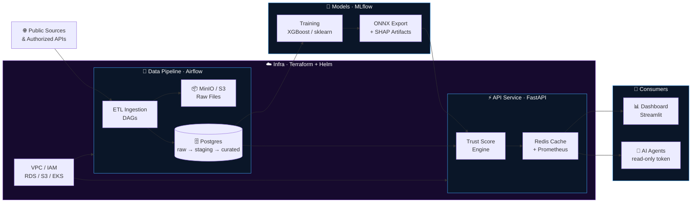
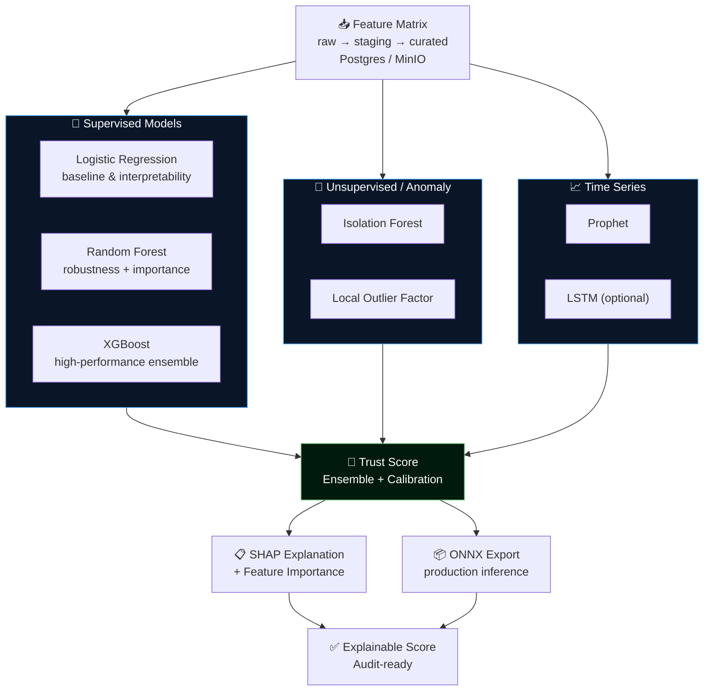

<p align="center">
  
</p>

<p align="center">
  
</p>

<br/>

<p align="center">
  <a href="https://github.com/maykonlincolnusa/Security-Bank-assessment/actions">
    
  </a>
  
  
  
  
</p>

<p align="center">
  
  
  
  
  
</p>

<p align="center">
  
  
  
  
  
  
</p>

<br/>

> [!WARNING]
> **Legal Disclaimer:** This system is a **decision-support tool** only. It does not replace human analysis, legal counsel, or regulatory decisions. Trust Scores must be used as complementary input to processes supervised by qualified professionals.

<br/>

## 📑 Table of Contents

| | Section |
|---|---|
| 🏦 | [Overview](#-overview) |
| 🏗️ | [System Architecture](#%EF%B8%8F-system-architecture) |
| ⚡ | [Data Flow](#-data-flow) |
| 🛠️ | [Tech Stack](#%EF%B8%8F-tech-stack) |
| 📂 | [Monorepo Structure](#-monorepo-structure) |
| 🚀 | [Quick Start](#-quick-start) |
| 🔄 | [Module Execution](#-module-execution) |
| 🤖 | [ML Models](#-ml-models) |
| 📡 | [Scoring API](#-scoring-api) |
| ☁️ | [Cloud Infrastructure](#%EF%B8%8F-cloud-infrastructure) |
| 🔒 | [Security & Compliance](#-security--compliance) |
| 🧪 | [Tests & Quality](#-tests--quality) |
| 🤝 | [Contributing](#-contributing) |
| 📄 | [License](#-license) |

<br/>

---

## 🏦 Overview

**Trust Bank System** is a production-grade, end-to-end open-source platform for generating, serving, and explaining **Trust Scores** for financial institutions. It integrates public data collection, Airflow-orchestrated ETL pipelines, ML model training and export (scikit-learn, XGBoost, ONNX), a high-performance REST API with JWT/OAuth2 authentication, and an interactive analytics dashboard — fully deployable on cloud (AWS/EKS) via Terraform and Helm.

```
╔══════════════════════════════════════════════════════════════════════════════╗
║                       TRUST BANK SYSTEM · v0.1.0                           ║
╠══════════════════════════════════════════════════════════════════════════════╣
║                                                                              ║
║   Public Sources ──► Airflow ETL ──► Postgres / MinIO ──► ML Training       ║
║        └─────────────────────────────────────────────────► ONNX Model       ║
║                                                                  │           ║
║   AI Agents ◄── FastAPI (JWT · RBAC · Redis Cache) ◄────────────┘           ║
║   Dashboard ◄──────────────────┘                                             ║
║                                                                              ║
║   Infrastructure: Terraform · EKS · Helm · GitHub Actions                   ║
║   Compliance:     LGPD · GDPR · STRIDE · Audit Logs · Bandit · Safety       ║
╚══════════════════════════════════════════════════════════════════════════════╝
```

### ✨ Key Features

| Feature | Detail |
|---|---|
| 🔄 **Full ETL Pipeline** | Airflow DAGs, raw/staging/curated layers, MinIO/S3 |
| 🤖 **Explainable ML** | XGBoost + SHAP + ONNX export + MLflow tracking |
| ⚡ **Production-Grade API** | FastAPI async, JWT/OAuth2, RBAC, Redis cache, Prometheus |
| 📊 **Analytics Dashboard** | Streamlit with score visualization and explainability |
| 🔒 **Security-First** | STRIDE, LGPD/GDPR, prompt injection tests, audit logs |
| ☁️ **Cloud-Native** | Terraform (VPC/IAM/RDS/S3/EKS) + Helm + CI/CD |

<br/>

---

## 🏗️ System Architecture



<br/>

---

## ⚡ Data Flow

```
 🌐 Public          🔄 Airflow         🗄️ Postgres        🤖 XGBoost
  Sources    ──►    ETL DAGs    ──►   raw→staging    ──►   Training
                       │               →curated             │
                       ▼                                     ▼
                  📦 MinIO / S3                        ONNX Export
                   Raw Files                           + SHAP Artifacts
                                                             │
 📊 Dashboard  ◄── 🔌 WebSocket   ◄── ⚡ FastAPI API ◄──────┘
 🤖 AI Agents  ◄── Redis Cache        JWT · RBAC
                                      Prometheus
```

| Layer | Technology | Role |
|---|---|---|
| Ingestion | Apache Airflow DAGs | Orchestrate ETL jobs |
| Storage | PostgreSQL 15 + MinIO | Structured + object storage |
| Training | XGBoost · scikit-learn · MLflow | Model training & tracking |
| Export | ONNX Runtime + SHAP | Inference + explainability |
| API | FastAPI + Redis | Scoring endpoint + caching |
| Dashboard | Streamlit | Visual analytics |
| Infra | Terraform + Helm + EKS | Cloud deployment |

<br/>

---

## 🛠️ Tech Stack

```
╔══════════════════════════════════════════════════════════════════════╗
║  LAYER                TECHNOLOGIES                                   ║
╠══════════════════════════════════════════════════════════════════════╣
║  Data Engineering     Python · Apache Airflow · pandas · SQLAlchemy  ║
║                       PostgreSQL 15 · MinIO / AWS S3                ║
╠══════════════════════════════════════════════════════════════════════╣
║  Machine Learning     scikit-learn · XGBoost · PyTorch (optional)   ║
║                       Prophet / LSTM · SHAP · MLflow · ONNX Runtime ║
╠══════════════════════════════════════════════════════════════════════╣
║  API & Services       FastAPI · Uvicorn · Redis 7 · OAuth2 Bearer   ║
║                       JWT · RBAC · Prometheus Metrics               ║
╠══════════════════════════════════════════════════════════════════════╣
║  Dashboard            Streamlit · Plotly · pandas                   ║
╠══════════════════════════════════════════════════════════════════════╣
║  Infra & DevOps       Terraform · Helm · GitHub Actions · Docker    ║
║                       AWS VPC · IAM · RDS · S3 · EKS                ║
╠══════════════════════════════════════════════════════════════════════╣
║  Security             STRIDE · LGPD / GDPR · Bandit · Safety        ║
║                       Audit Logs · Prompt Injection Tests           ║
╚══════════════════════════════════════════════════════════════════════╝
```

<br/>

---

## 📂 Monorepo Structure

<details>
<summary><b>🗂️ Expand full structure</b></summary>

```
Security-Bank-assessment/
│
├── 🔄 data_pipeline/          # ETL · Apache Airflow · DAGs · SQL
│   ├── dags/                  # Airflow DAG definitions
│   ├── src/etl/               # Ingestion & transformation modules
│   ├── sql/init.sql           # Postgres layer initialization
│   ├── data/                  # Local development data
│   ├── requirements.txt
│   └── Dockerfile
│
├── 🤖 models/                 # Training · Evaluation · ONNX Export
│   ├── scripts/train_all.py   # Training entry-point
│   ├── export_model.py        # ONNX export + feature metadata
│   ├── output/                # Artifacts: model.onnx, features, SHAP
│   ├── notebooks/             # Exploration & experiments (Jupyter)
│   └── requirements.txt
│
├── ⚡ api_service/             # FastAPI · JWT/OAuth2 · Redis · RBAC
│   ├── app/
│   │   ├── main.py            # FastAPI entry-point
│   │   ├── routers/           # Scoring & admin endpoints
│   │   ├── services/          # Business logic & ONNX inference
│   │   └── models/            # Pydantic schemas
│   ├── sql/init.sql
│   ├── requirements.txt
│   └── Dockerfile
│
├── 📊 dashboard/              # Streamlit · Score visualization
│   ├── app.py                 # Streamlit entry-point
│   ├── data/                  # Demo CSVs: scores & explanations
│   ├── requirements.txt
│   └── Dockerfile
│
├── ☁️  infra/                  # Terraform · Helm · IaC
│   ├── terraform/             # VPC, IAM, RDS, S3, EKS modules
│   └── helm/                  # Chart values per environment
│
├── 🔒 security/               # Threat Model · LGPD/GDPR controls
│   └── docs/threat_model.md   # STRIDE + mapped controls
│
├── 🧪 tests/                  # pytest · unit & integration
├── 📄 docs/                   # Technical docs & checklists
├── 🔧 scripts/                # Operational utility scripts
├── .github/workflows/         # CI/CD GitHub Actions
│
├── docker-compose.yml         # Full local stack
├── Makefile                   # Shortcuts: lint, test, build, deploy
├── conftest.py                # Global pytest fixtures
├── pytest.ini
├── .env.example
├── CONTRIBUTING.md
├── SECURITY.md
└── LICENSE (MIT)
```

</details>

<br/>

---

## 🚀 Quick Start

**Prerequisites:** Docker >= 24 · docker compose >= 2 · Python >= 3.11 · GNU Make

<table>
<tr>
<th>🐧 Linux / macOS</th>
<th>🪟 Windows (PowerShell)</th>
</tr>
<tr>
<td>

```bash
# 1. Clone
git clone https://github.com/maykonlincolnusa/Security-Bank-assessment.git
cd Security-Bank-assessment

# 2. Environment variables
cp .env.example .env

# 3. Spin up full stack
docker compose up -d --build
```

</td>
<td>

```powershell
# 1. Clone
git clone https://github.com/maykonlincolnusa/Security-Bank-assessment.git
cd Security-Bank-assessment

# 2. Environment variables
Copy-Item .env.example .env

# 3. Spin up full stack
docker compose up -d --build
```

</td>
</tr>
</table>

### 🌐 Available Services

| Service | URL | Default Credentials |
|---|---|---|
| 📡 **API Swagger** | http://localhost:8000/docs | JWT via `/auth/token` |
| 📊 **Dashboard** | http://localhost:8501 | — |
| 🔄 **Airflow UI** | http://localhost:8080 | `admin / admin` |
| 🗄️ **MinIO Console** | http://localhost:9001 | `minioadmin / minioadmin` |
| 🗃️ **Postgres Pipeline** | `localhost:5432` | `airflow / airflow` |
| 🗃️ **Postgres Service** | `localhost:5433` | `service / service` |
| 📈 **Prometheus Metrics** | http://localhost:8000/metrics | — |

<br/>

---

## 🔄 Module Execution

<details>
<summary><b>📦 ETL Pipeline</b></summary>

```bash
# Install dependencies
python -m pip install -r data_pipeline/requirements.txt

# Run daily pipeline via CLI
PYTHONPATH=data_pipeline/src python -m etl.cli run-daily
```

**Data Lake Layers:**

| Layer | Description |
|---|---|
| `raw` | Raw ingested data — no transformation |
| `staging` | Cleaned, standardized, typed |
| `curated` | ML-ready features for API and training |

</details>

<details>
<summary><b>🤖 Model Training</b></summary>

```bash
# Install dependencies
python -m pip install -r models/requirements.txt

# Train all models
python -m models.scripts.train_all

# Export to ONNX (with feature metadata + SHAP)
python models/export_model.py \
  --model-path models/output/best_model.joblib \
  --sample-csv models/output/training_dataset.csv \
  --output-dir models/output
```

**Generated artifacts in `models/output/`:**
- `model.onnx` — optimized inference model
- `model_features.json` — feature schema
- `feature_importance.json` — SHAP values

```
╔══════════════════════════════════════════════════════════╗
║  Model           Framework      Purpose                  ║
╠══════════════════════════════════════════════════════════╣
║  XGBoost         scikit-learn   Primary trust score      ║
║  Random Forest   scikit-learn   Ensemble / fallback      ║
║  PyTorch MLP     PyTorch        Optional / experimental  ║
║  Prophet / LSTM  statsmodels    Time-series analysis     ║
║  SHAP            SHAP lib       Explainability           ║
╚══════════════════════════════════════════════════════════╝
```

</details>

<details>
<summary><b>⚡ Scoring API</b></summary>

```bash
# Install dependencies
python -m pip install -r api_service/requirements.txt

# Start dev server
uvicorn api_service.app.main:app \
  --reload --host 0.0.0.0 --port 8000
```

**Main Endpoints:**

| Method | Endpoint | Description |
|---|---|---|
| `POST` | `/auth/token` | Obtain JWT via OAuth2 |
| `POST` | `/v1/score` | Compute Trust Score |
| `GET` | `/v1/score/{id}` | Query score by ID |
| `GET` | `/v1/explanation/{id}` | SHAP explainability |
| `GET` | `/health` | Health check |
| `GET` | `/metrics` | Prometheus metrics |

```bash
# Example scoring request
curl -X POST http://localhost:8000/v1/score \
  -H "Authorization: Bearer <JWT_TOKEN>"   \
  -H "Content-Type: application/json"      \
  -d '{"institution_id": "BR_BANK_001", "reference_date": "2025-12-31"}'
```

</details>

<details>
<summary><b>📊 Analytics Dashboard</b></summary>

```bash
# Install dependencies
python -m pip install -r dashboard/requirements.txt

# Start Streamlit
streamlit run dashboard/app.py

# With demo data (no API required)
DEMO_DATA_PATH=dashboard/data/demo_trust_scores.csv \
streamlit run dashboard/app.py
```

</details>

<br/>

---

## 🤖 ML Models



**MLflow Tracking** — every training run is tracked with parameters, metrics, and artifacts. Compare model versions before promoting to production.

<br/>

---

## 📡 Scoring API

<details>
<summary><b>📋 Example · Score Request</b></summary>

```bash
# 1. Authenticate
curl -X POST http://localhost:8000/auth/token \
  -d "username=analyst&password=<password>"

# 2. Request trust score
curl -X POST http://localhost:8000/v1/score \
  -H "Authorization: Bearer <JWT_TOKEN>"    \
  -H "Content-Type: application/json"       \
  -d '{
    "institution_id":  "BR_BANK_001",
    "reference_date":  "2025-12-31"
  }'
```

**Expected response:**

```json
{
  "institution_id":  "BR_BANK_001",
  "trust_score":     0.74,
  "risk_level":      "MEDIUM",
  "shap_top_features": [
    { "feature": "capital_adequacy_ratio", "shap_value": 0.18 },
    { "feature": "npl_ratio",              "shap_value": -0.12 },
    { "feature": "liquidity_coverage",     "shap_value": 0.09 }
  ],
  "model_version":   "xgboost-v2.1.0-onnx",
  "reference_date":  "2025-12-31",
  "generated_at":    "2025-03-18T14:22:03Z"
}
```

</details>

<br/>

---

## ☁️ Cloud Infrastructure

<details>
<summary><b>🌩️ AWS Deploy · Terraform + Helm</b></summary>

```bash
# Initialize Terraform
cd infra/terraform
terraform init

# Review execution plan
terraform plan -var-file=envs/prod.tfvars

# Apply infrastructure
terraform apply -var-file=envs/prod.tfvars

# Deploy via Helm (post-EKS)
cd ../helm
helm upgrade --install trust-bank ./trust-bank-chart \
  --namespace trust-bank                              \
  --values values-prod.yaml
```

**Provisioned Resources:**

```
╔════════════════════════════════════════════════════════════╗
║  AWS Resource         Terraform Module                     ║
╠════════════════════════════════════════════════════════════╣
║  VPC + Subnets        modules/networking                   ║
║  IAM Roles/Policies   modules/iam                         ║
║  RDS PostgreSQL       modules/rds                         ║
║  S3 Buckets           modules/storage                     ║
║  EKS Cluster          modules/eks                         ║
║  KMS Keys             modules/kms                         ║
╚════════════════════════════════════════════════════════════╝
```

</details>

**CI/CD Pipeline:**

```mermaid
graph LR
    A["⬆️ Push / PR"] --> B["🔍 Lint\nflake8"]
    B --> C["🛡️ SAST\nBandit"]
    C --> D["🔐 Dep Safety\nsafety check"]
    D --> E["🧪 Pytest\n+ Coverage"]
    E --> F["🐳 Docker\nBuild"]
    F --> G{main branch?}
    G -->|Yes| H["🚀 Deploy\nHelm → EKS"]
    G -->|No|  I["✅ PR Ready\nfor Review"]

    style A fill:#0a1628,stroke:#42A5F5,color:#fff
    style H fill:#0a2e1a,stroke:#66BB6A,color:#fff
    style I fill:#0a2e1a,stroke:#66BB6A,color:#fff
```

<br/>

---

## 🔒 Security & Compliance

```
╔══════════════════════════════════════════════════════════════════════╗
║                       SECURITY FRAMEWORK                             ║
╠══════════════════════════════════════════════════════════════════════╣
║  STRIDE Threat Model   Spoofing · Tampering · Repudiation            ║
║                        Info Disclosure · DoS · Elevation of Priv.   ║
╠══════════════════════════════════════════════════════════════════════╣
║  Compliance            LGPD (Lei 13.709/2018)                       ║
║                        GDPR (EU Regulation 2016/679)                ║
╠══════════════════════════════════════════════════════════════════════╣
║  Auth & Access         JWT Bearer Tokens · OAuth2 Client Creds      ║
║                        RBAC (role-based access control)             ║
╠══════════════════════════════════════════════════════════════════════╣
║  Static Analysis       bandit (Python SAST) · safety (CVE deps)    ║
║                        flake8 · secret-detector in CI               ║
╠══════════════════════════════════════════════════════════════════════╣
║  AI Security           Prompt Injection testing on AI agents        ║
║                        Read-only tokens with minimum scope          ║
╠══════════════════════════════════════════════════════════════════════╣
║  Audit & Observability Immutable audit logs · Prometheus metrics    ║
║                        Full ML decision traceability                ║
╚══════════════════════════════════════════════════════════════════════╝
```

> [!IMPORTANT]
> **Golden Security Rules:**
> - ❌ Never commit real secrets — use Secret Manager / KMS in production
> - ✅ AI agent tokens must always be **read-only** with minimum scope
> - ✅ Agents must run **isolated**, with no write permissions in production
> - 📄 See [`SECURITY.md`](./SECURITY.md) and [`security/docs/threat_model.md`](./security/docs/threat_model.md)

<br/>

---

## 🧪 Tests & Quality

```bash
# Full lint
make lint

# Full test suite
make test

# Or individually:
flake8 .                           # PEP8 style
bandit -r . -ll                    # Static security analysis
safety check                       # Dependency vulnerability scan
pytest --cov=. --cov-report=html   # Tests with coverage report
```

<br/>

---

## 🤝 Contributing

See [`CONTRIBUTING.md`](./CONTRIBUTING.md) for the full flow. In summary:

```bash
# 1. Fork + clone
git clone https://github.com/YOUR_USERNAME/Security-Bank-assessment.git

# 2. Create feature branch
git checkout -b feat/my-feature

# 3. Develop with quality
make lint && make test

# 4. Semantic commit
git commit -m "feat: add new BACEN data extractor"

# 5. Push and open Pull Request
git push origin feat/my-feature
```

**Commit Convention:**

| Prefix | Usage |
|---|---|
| `feat:` | New feature |
| `fix:` | Bug fix |
| `docs:` | Documentation |
| `refactor:` | Refactoring without behavior change |
| `test:` | Adding or fixing tests |
| `chore:` | Maintenance tasks |
| `security:` | Security fix or improvement |

<br/>

---

## 📋 Operational Validation

See the full checklist at [`docs/VALIDATION_CHECKLIST.md`](./docs/VALIDATION_CHECKLIST.md) before any production deployment.

<details>
<summary><b>✅ Summary Checklist</b></summary>

- [ ] `.env` configured with real secrets via KMS / Secret Manager
- [ ] Models trained and ONNX artifacts in `models/output/`
- [ ] All tests passing (`make test`)
- [ ] Lint clean (`make lint`)
- [ ] Terraform plan reviewed and approved
- [ ] Agent tokens validated as read-only with minimum scope
- [ ] Audit logs enabled in target environment
- [ ] LGPD/GDPR: consent and data retention policies configured

</details>

<br/>

---

## 📄 License

This project is licensed under the **MIT License** — see [`LICENSE`](./LICENSE) for details.

```
MIT License · Copyright (c) 2025 Maykon Lincoln
Commercial use permitted with copyright notice preservation.
```

---

<p align="center">
  <a href="https://github.com/maykonlincolnusa">
    
  </a>
  
  
  
  
</p>

<p align="center">
  <b>Maykon Lincoln</b> · Senior Systems Engineer & AI Architect<br/>
  <sub>Enterprise AI/ML · Cybersecurity · Cloud Infrastructure · Data Engineering</sub>
</p>

<br/>

<p align="center">
  
</p>
