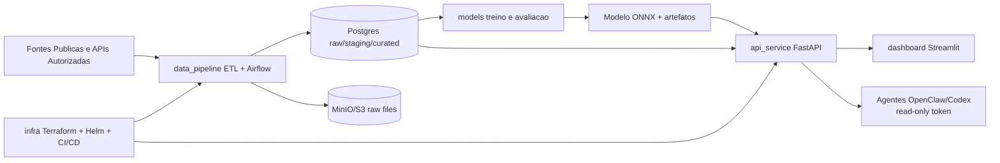

# Trust Bank System

Plataforma open source para gerar e servir **Trust Score** de instituicoes financeiras com pipeline ETL, modelos de ML, API de scoring, integracao com agentes, infraestrutura cloud e dashboard analitico.

> Aviso legal: este sistema e **auxilio de decisao**. Nao substitui analise humana, parecer juridico ou decisoes regulatorias.

## Arquitetura



## Estrutura do Monorepo

```text
trust-bank-system/
├── data_pipeline/
├── models/
├── api_service/
├── infra/
├── security/
├── dashboard/
├── docs/
├── tests/
├── scripts/
├── .github/workflows/
├── docker-compose.yml
├── Makefile
├── README.md
├── LICENSE
├── .gitignore
└── .env.example
```

## Stack

- Data Engineering: Python, Airflow, pandas, SQLAlchemy, Postgres, MinIO/S3
- ML: scikit-learn, XGBoost, PyTorch (opcional), Prophet/LSTM (opcional), SHAP, MLflow
- API: FastAPI, Uvicorn, Redis, OAuth2 bearer (template), RBAC, Prometheus metrics
- Infra: Terraform (VPC/IAM/RDS/S3/EKS), Helm, GitHub Actions
- Security: STRIDE, controles LGPD/GDPR, testes de prompt injection, audit logs

## Setup Local (Docker Compose)

1. Copie variaveis de ambiente:
```bash
cp .env.example .env
```

2. Suba stack local:
```bash
docker compose up -d --build
```

3. Acesse servicos:
- Airflow: `http://localhost:8080`
- API docs: `http://localhost:8000/docs`
- Dashboard: `http://localhost:8501`
- MinIO console: `http://localhost:9001`

## Execucao por Modulo

### Pipeline ETL
```bash
python -m pip install -r data_pipeline/requirements.txt
PYTHONPATH=data_pipeline/src python -m etl.cli run-daily
```

### Treino de Modelo
```bash
python -m pip install -r models/requirements.txt
python -m models.scripts.train_all
python models/export_model.py --model-path models/output/best_model.joblib --sample-csv models/output/training_dataset.csv --output-dir models/output
```

### API de Score
```bash
python -m pip install -r api_service/requirements.txt
uvicorn api_service.app.main:app --reload --host 0.0.0.0 --port 8000
```

### Dashboard
```bash
python -m pip install -r dashboard/requirements.txt
streamlit run dashboard/app.py
```

## Testes e Qualidade

```bash
make lint
make test
```

CI executa:
- Lint (`flake8` e `eslint` quando houver projeto Node)
- Testes (`pytest`)
- Seguranca (`bandit`, `safety`, detector de secrets)
- Build de imagens Docker

## Seguranca

- Nao versionar segredos reais.
- Use `.env` local e secret manager/KMS em ambiente real.
- Tokens de agentes devem ser **read-only** e com escopo minimo.
- Agentes devem rodar isolados e sem permissao de escrita em producao.

Veja: `SECURITY.md` e `security/docs/threat_model.md`.

## Contribuicao

Leia `CONTRIBUTING.md` para fluxo de branch, padroes de commit e checklist de PR.

## Licenca

Este projeto usa licenca **MIT** (`LICENSE`), permitindo uso comercial com preservacao do aviso de copyright.

## Publicacao no GitHub

1. Criar repositorio remoto no GitHub.
2. Executar:
```bash
git init
git add .
git commit -m "feat: initial commit - trust bank system"
git branch -M main
git remote add origin https://github.com/SEU_USERNAME/trust-bank-system.git
git push -u origin main
git checkout -b dev
git push -u origin dev
git tag v0.1.0
git push origin v0.1.0
```

## Validacao Final

Checklist operacional em `docs/VALIDATION_CHECKLIST.md`.
