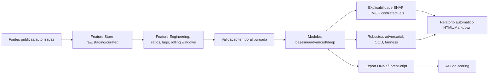
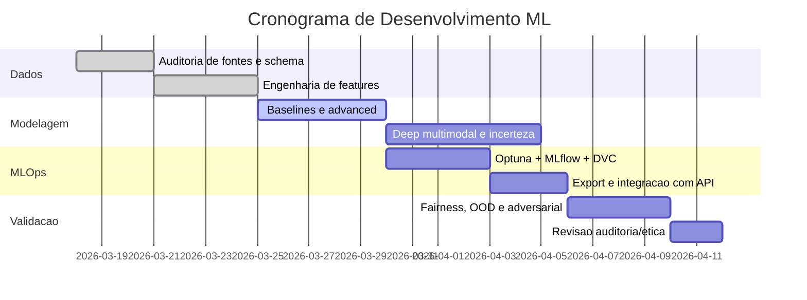

# ML Architecture and Timeline

## Architecture (Mermaid)

## Timeline (Mermaid)

## Notas

- Fontes privadas reais: **nao especificado**.
- Treino federado em producao: **nao especificado**.
- BNN completa com VI/MCMC: **nao especificado**.
